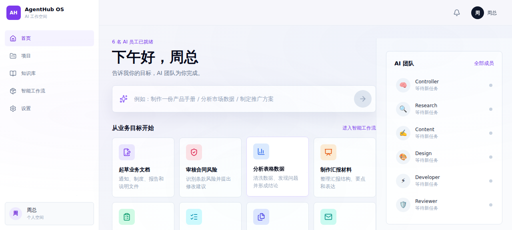
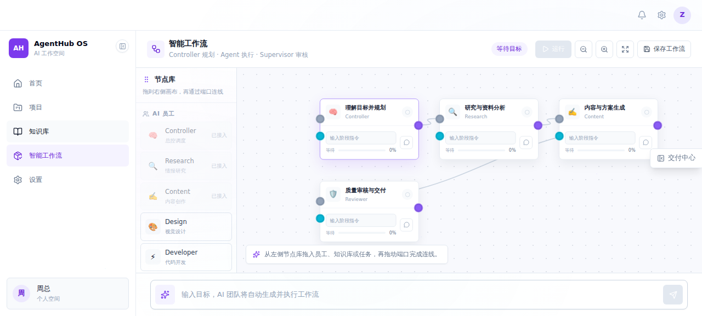
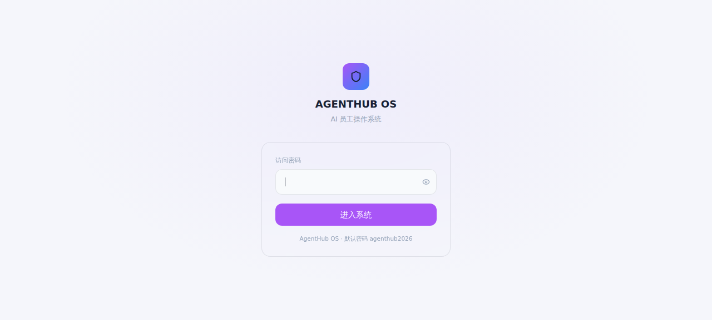

# 🏢 AgentHub OS

**像管理员工一样，管理你的 AI Agent。**

AgentHub OS 是一个 AI Agent 管理平台，帮你把多个 AI Agent 组织成一支协同工作的团队。不用在终端和聊天窗口之间来回切换——一个面板，统一调度。

---

## 📸 界面预览

### 主页仪表盘


### 智能工作流画布


### 登录页


---

## ✨ 功能

### 🎛️ 多 Agent 面板
- 一键切换不同 Agent，每个 Agent 独立配置、独立上下文
- 支持 Hermes Agent、Codex、OpenClaw 等多种运行时
- Agent 状态实时可见：空闲、工作中、等待输入

### 💬 多 Agent 对话
- 同一界面跟多个 Agent 同时交互
- 支持私聊和群聊模式
- Markdown 渲染、代码高亮、文件预览

### 📊 实时监控
- Agent 心跳检测，离线自动告警
- 任务执行时间线，回溯每一步操作
- 工作日志自动归档

### 🔧 Provider 统一配置
- API Key 集中管理，一个地方配置所有模型
- 支持 OpenAI、DeepSeek、Anthropic 等主流 Provider
- 模型切换无需改代码

### 📝 工作流画布
- 可视化编排 Agent 协作流程
- 拖拽式任务分配
- 并行/串行执行策略

### 🧠 Agent 智能调度
- Controller 引擎自动分配任务给最合适的 Agent
- 质量门控——输出不合格自动返工
- 记忆系统跨会话保持上下文

---

## 🛠 技术栈

| 层 | 技术 |
|---|---|
| 框架 | Next.js 14 (App Router) |
| UI | React 18 + Tailwind CSS + Framer Motion |
| 状态 | Zustand |
| 语言 | TypeScript |
| 图表 | Lucide Icons |

---

## 🚀 快速开始

```bash
git clone https://github.com/landiao5893-netizen/agenthub-os.git
cd agenthub-os
npm install
cp .env.example .env.local
# 编辑 .env.local 填入配置
npm run dev
```

打开 http://localhost:3099

---

## ⚙️ 环境变量

| 变量 | 必填 | 说明 |
|---|---|---|
| `AGENTHUB_PASSWORD` | ✅ | 登录密码 |
| `AGENTHUB_SESSION_SECRET` | ✅ | Session 密钥（32位随机字符串） |
| `HERMES_API_TOKEN` | - | Hermes Agent API Token |
| `AGENTHUB_IMAGE_API_URL` | - | 图片生成 API 地址 |

---

## 📁 项目结构

```
src/
├── app/              # Next.js App Router（页面 + API）
│   ├── api/          # 后端 API 路由
│   ├── chat/         # 对话页
│   ├── settings/     # 设置页
│   └── ...
├── components/       # React 组件
│   ├── agents/       # Agent 管理面板
│   ├── chat/         # 聊天组件
│   ├── workflow/     # 工作流画布
│   ├── monitor/      # 监控面板
│   └── layout/       # 布局组件
├── stores/           # Zustand 状态管理
├── controller/       # Agent 调度引擎
├── supervisor/       # 质量监控
├── memory/           # 记忆系统
├── workspace/        # 工作区引擎
└── runtime-engine/   # 运行时适配器
```

---

## 📄 License

MIT

---

> Built with ❤️ by [landiao5893-netizen](https://github.com/landiao5893-netizen)
